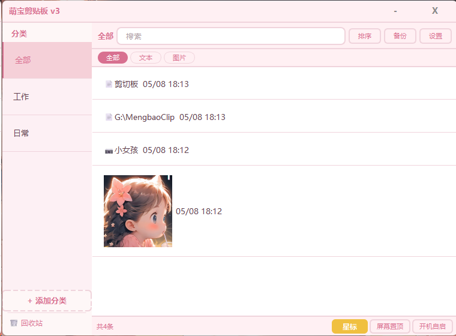
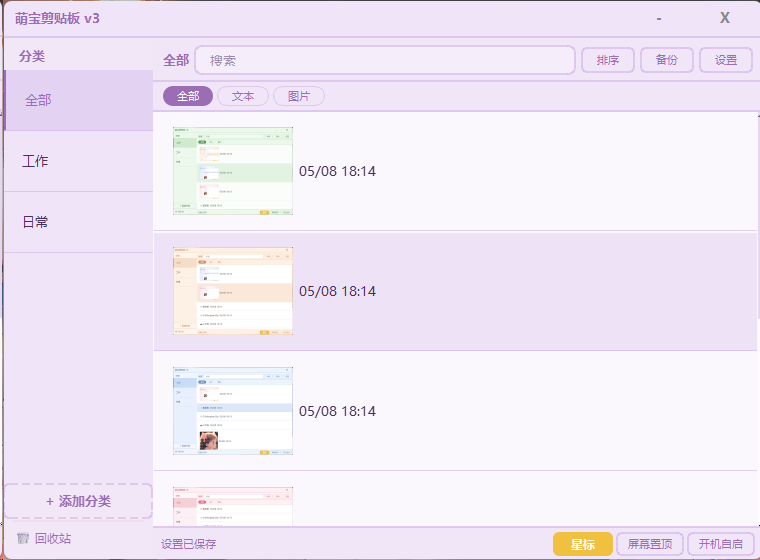
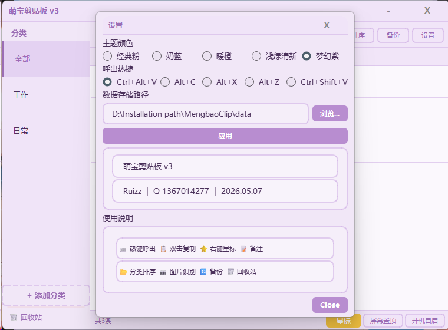

# 🐾 萌宝剪贴板

> 一款基于 PyQt6 的 Windows 剪贴板管理工具，可爱又好用！

---

## ✨ 功能一览

| 功能 | 说明 |
|------|------|
| 📋 剪贴板历史 | 自动记录复制的文本和图片 |
| 🔍 实时搜索 | 快速查找历史记录 |
| ⭐ 星标收藏 | 重要的内容一键标记 |
| 📝 备注功能 | 给条目添加备注名称 |
| 📂 分类管理 | 自定义分类，拖拽排序 |
| 🗑️ 回收站 | 误删可恢复，安心使用 |
| 📷 图片支持 | 自动保存图片，缩略图预览 |
| 🔍 OCR 识别 | 图片转文字（需安装 Tesseract） |
| 🎨 多种主题 | 经典粉、奶蓝、暖橙、浅绿、梦幻紫 |
| 🖥️ 系统托盘 | 后台常驻，热键呼出 |
| 🔄 数据备份 | 导出/导入，数据不丢失 |
| ⚡ 开机自启 | 可选开机自动启动 |
| 🔒 单实例保护 | 重复点击直接弹出已有窗口 |

---

## 📸 截图

**主界面 & 系统托盘**

 

**5 种主题**

    

**设置页面**



---

## 🚀 快速开始

### 直接运行源码

```bash
pip install PyQt6 pillow pytesseract
python clipboard_single.py
```

### 打包成 EXE

```bash
pip install PyInstaller
python -m PyInstaller --clean --onefile --windowed --noconsole ^
  --name "MengbaoClip" --distpath "dist_release" ^
  --add-data "icon_r.png;." --icon "icon_r.png" ^
  clipboard_single.py
```

### 一键安装

双击 `install.bat`，自动打包 + 创建快捷方式。

---

## 📦 项目结构

```
MengbaoClip/
├── clipboard_single.py   # 主程序（单文件，无额外模块依赖）
├── icon_r.png            # 应用图标
├── install.bat           # 安装脚本
├── uninstall.bat         # 卸载脚本
├── build_final.bat       # 打包脚本
├── make_shortcuts.vbs    # 快捷方式辅助脚本
├── .gitignore
├── LICENSE
└── README.md
```

---

## 🔧 技术栈

- **Python 3.13** + **PyQt6**
- **Pillow** — 图片处理
- **PyInstaller** — 打包 EXE
- **pytesseract** — OCR 识别（可选）
- **QLocalServer/QLocalSocket** — 单实例进程间通信

---

## 📝 更新日志

### v3.0 (2026-05-08)

#### ✨ 新增
- 时间显示 — 每条记录显示复制时间
- 图片查看 — 右键查看原图
- 备注增强 — 有备注的条目显示图标 + 备注
- 分类管理 — 自定义分类，拖拽排序
- 回收站 — 删除可恢复
- OCR 识别 — 图片转文字
- 多主题 — 5 种主题切换
- 单实例保护 — 重复点击弹出已有窗口

#### 🐛 修复
- 修复双击复制只复制标题不复制全文
- 修复分类筛选显示混乱
- 修复图片缩略图大小不一致
- 修复复制文件时显示路径
- 修复 QQ 等应用复制图片不显示
- 修复热键响应不灵敏
- 修复任务栏点击无法最小化
- 修复单实例保护导致窗口透明/边框问题

#### 🎨 优化
- 界面名称统一为「萌宝剪贴板」
- 左上角标题改为「萌宝剪贴板 v3」
- 状态栏按钮重命名
- 设置页使用说明精简

---

## 👤 作者

**Ruizz**
Q: 1367014277

---

## 📄 许可协议

本软件允许免费使用和分发，但**禁止修改源代码**或创建衍生作品。详见 [LICENSE](LICENSE)。
